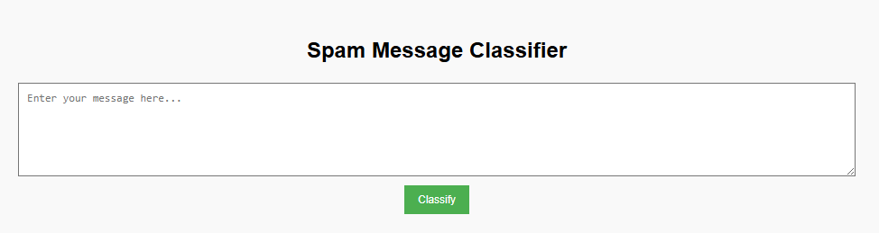
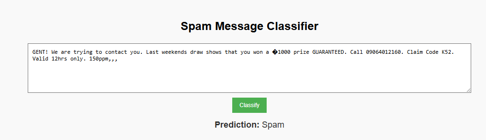

#  Naive Bayes Spam Detection

This project is a simple **Spam/Ham classifier** using the Naive Bayes algorithm.  
It classifies incoming text messages as either **Spam** or **Not Spam** based on historical data.

---

##  Project Screenshot
 

------------
output:


---

##  Project Structure

naive_bayes_spam_detection/  
│  
├── dataset/  
│   └── spam.csv # Dataset containing labeled SMS messages  
│  
├── model/  
│   └── model.pkl # Trained Naive Bayes model  
│  
├── app.py # Flask web application  
├── train_model.py # Script to train the model  
├── predict_model.py # CLI script to test predictions  
├── templates/  
│   └── index.html # Frontend template for input form  
└── README.md  

---

##  Dataset

The dataset `spam.csv` contains labeled SMS messages:

- **label**: `ham` (not spam) or `spam`
- **message**: text content of the message

Example:

| label | message |
|-------|---------|
| ham   | Go until jurong point, crazy.. Available only in Bugis... |
| spam  | WINNER!! As a valued network customer you have won £900... |

---

##  Installation & Setup

1. **Clone the repository**
   ```bash
   git clone https://github.com/nithinskumar866/naive_bais_model.git
   cd naive_bayes_spam_detection
````

2. **Install dependencies**

   ```bash
   pip install -r requirements.txt
   ```

3. **Train the model**

   ```bash
   python train_model.py
   ```

4. **Run the Flask app**

   ```bash
   python app.py
   ```

5. **Access the app**
   Open your browser at: `http://127.0.0.1:5000`

---

##  Model Details

* **Algorithm**: Multinomial Naive Bayes
* **Vectorization**: CountVectorizer (Bag-of-Words)
* **Train/Test Split**: 80/20

---

##  Usage

### Web App

* Enter your SMS text into the input box.
* Click **Predict** to see if it’s Spam or Not Spam.

### Command Line

```bash
python predict_model.py
```

Then enter a message when prompted.

---

##  Example Prediction

**Input:**

```text
WINNER! You have won a free ticket to Bahamas. Call now!
```

**Output:**

```text
Prediction: Spam
```


